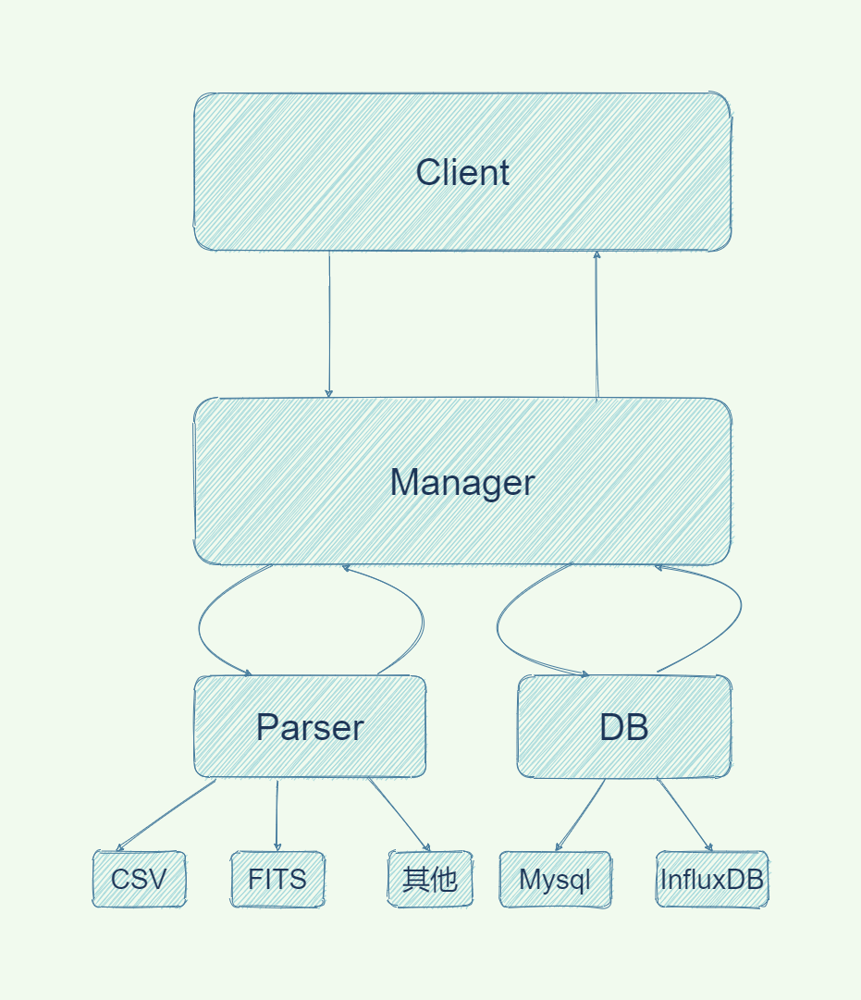

# AstroStore
A idea to try store astronomical time series data in influxDB.

## 分布式存储天文数据架构

### 管理者模块(manager) 
主要管理元数据数据库及时序数据库集群的处理，并对外提供接口   

### 数据库模块(db)
主要负责数据库的管理与存储的实现   

### 解析器模块(parse)
主要负责文件的解析与生成
